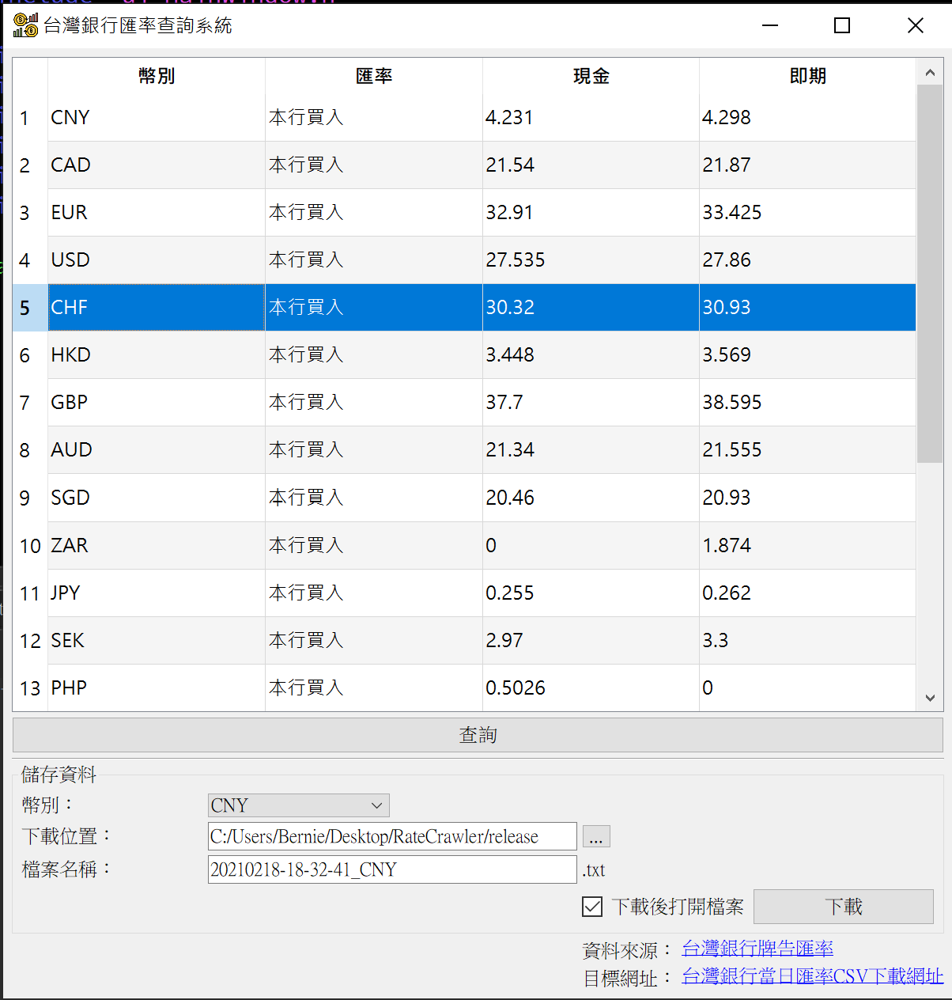
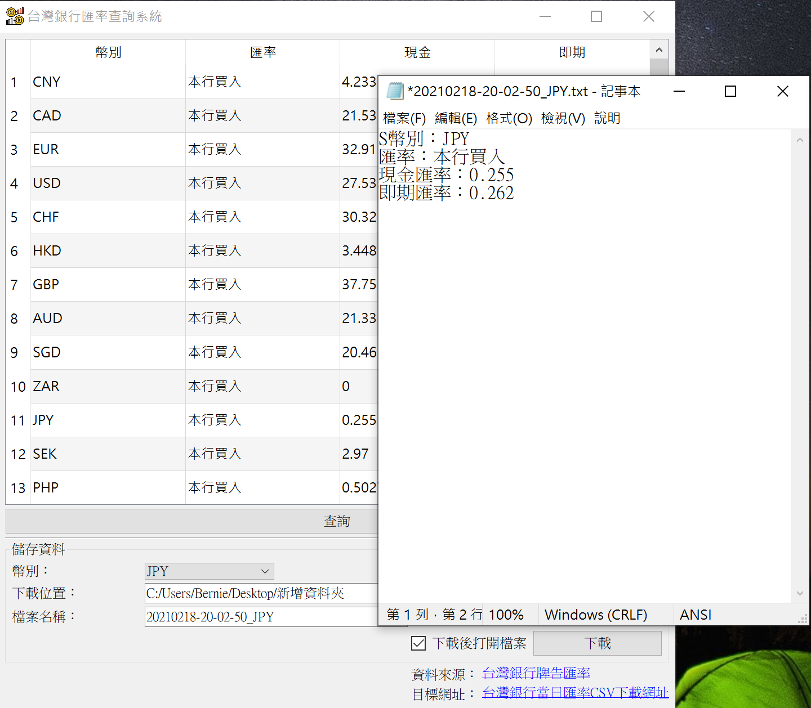

# CurrencyRateCrawler

## 台灣銀行匯率查詢系統
可下載[台灣銀行當日匯率]中的[CSV檔案]，將數據呈現於UI上，並可選擇相對應的幣值進行資料輸出。

>資料輸出檔案為.txt形式。

> *軟體icon來源：
Icons made by <a href="https://www.flaticon.com/authors/eucalyp" title="Eucalyp">Eucalyp</a> from <a href="https://www.flaticon.com/" title="Flaticon">www.flaticon.com</a>
*

[台灣銀行當日匯率]:https://rate.bot.com.tw/xrt?Lang=zh-TW
[CSV檔案]:https://rate.bot.com.tw/xrt/flcsv/0/day

*Fig 1. 台灣銀行匯率查詢系統操作畫面* 

*Fig 2. 檔案輸出畫面* 
